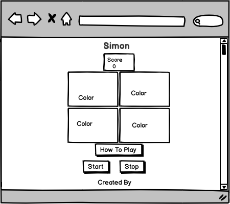

Project 
Simon is a game to test your memory. 

Idea of the game
The purpose of the game is to have a sequence of different colors display at random and prompt the player to repeat the same sequence. 

Technology Used
The game was built using HTML, CSS and JavaScrip.
The functionality includes:
  * Clicking "How To Play" to display the instructions. 
  * Clicking "Start" to begin the game.
  * If the pattern is followed successfully, the player wins and the Score will increase. 
  * If the pattern is incorrect, the player loses. 
  * There is also an "End" button if the player wants to stop the game.
  
Approach Used
Used Wireframing to visualize the page layout. 

[Scott's Project]
(https://henryscottg.github.io/Simon/)

 * The layout was all centralized on the screen to help keep the focus in one area. 
 
 User Stories
 * As a user, I should be able to understand how to play the game.
 * As a user, I should be able to if I've won or lost. 
 * As a user, I should be able to click a button to start the game.
 * As a user, I should be able to click a button to stop the game.
 * As a user, I should be able see which cells needs to be clicked.
 
 Future items
 * Correct the bug for the blinking pattern.
 * Display the score for the clicks. 
 * Create a more improved look/feel.
 * Avoid alerts, these are extra clicks. Maybe a clear game function.

 Lessons Learned
 * Code becomes unclear at times without a flow process.
 * Understand how the game moves through the code. 
 * Don't under estimate the complexity!
 
 
